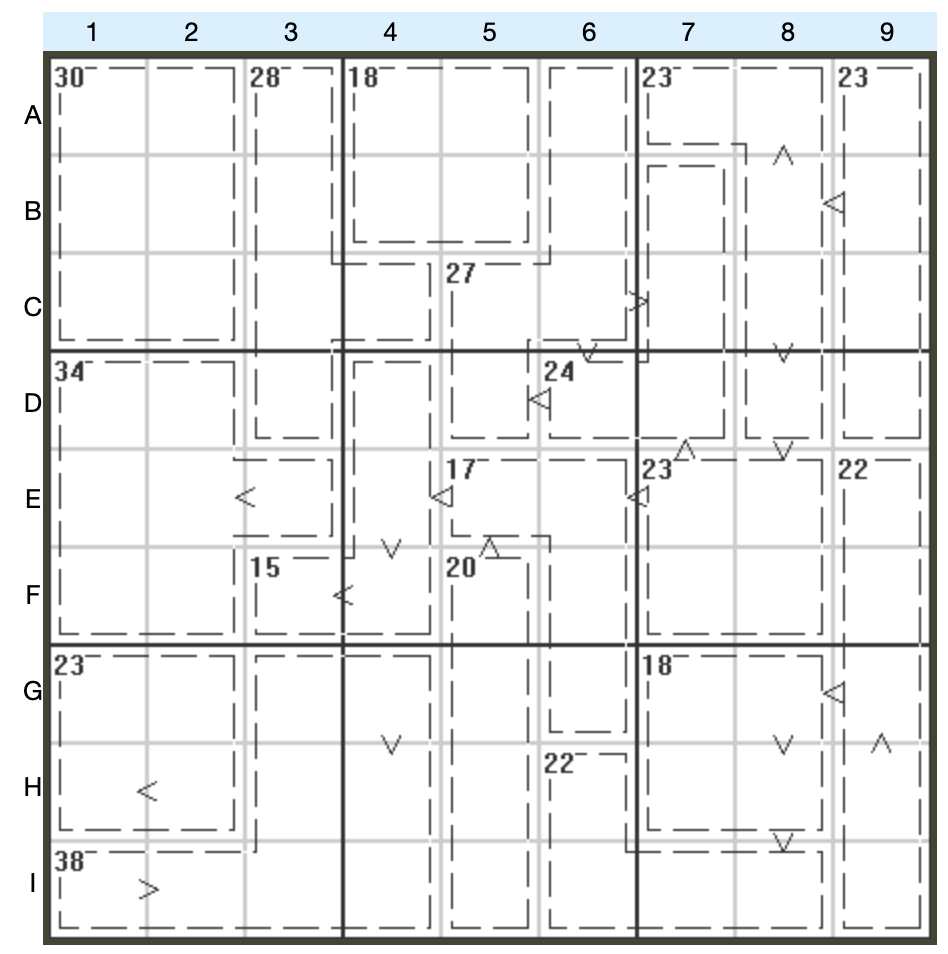

# 数比+杀手数独
<!-- START doctoc generated TOC please keep comment here to allow auto update -->
<!-- DON'T EDIT THIS SECTION, INSTEAD RE-RUN doctoc TO UPDATE -->
## 目录

- [规则](#%E8%A7%84%E5%88%99)
- [题型名](#%E9%A2%98%E5%9E%8B%E5%90%8D)
- [扩展题型](#%E6%89%A9%E5%B1%95%E9%A2%98%E5%9E%8B)

<!-- END doctoc generated TOC please keep comment here to allow auto update -->

## 规则

| 序号  | 限制区域 | 限制规则                                |   备注   |
|:---:|:----:|:------------------------------------|:------:|
|  1  |  行   | [1~9填充]                             |        |
|  2  |  列   | [1~9填充]                             |        |
|  3  |  宫   | [1~9填充]                             |        |
|  4  | 标记边  | 标记边两侧的[共边邻格]满足 `>` 的大小关系（即满足[数比]约束） |   半标   |
|  5  | 计算框  | [1~9不重复] 提示数 `S`：计算框内所有数字的和为 S  | &nbsp; |

## 题型名

- 数比杀手数独
- Greater Than Killer Sudoku

## 扩展题型

- [框比数独](框比数独.md)

[1~9填充]: ../../../rules/rules.md#1to9填充

[1~9不重复]: ../../../rules/rules.md#1to9不重复

[共边邻格]: ../../../rules/rules.md#共边邻格

[数比]: ../../../rules/rules.md#数比
