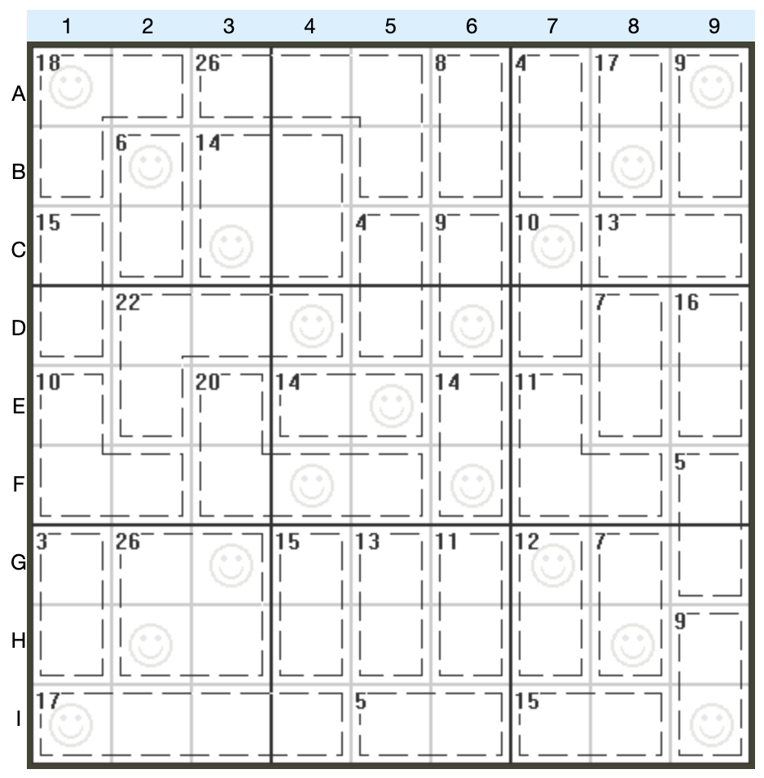

# 杀手+对角数独
<!-- START doctoc generated TOC please keep comment here to allow auto update -->
<!-- DON'T EDIT THIS SECTION, INSTEAD RE-RUN doctoc TO UPDATE -->

<!-- END doctoc generated TOC please keep comment here to allow auto update -->

## 规则

| 序号  | 限制区域 | 限制规则                                |
|:---:|:----:|:------------------------------------|
|  1  |  行   | [1~9填充]                            |
|  2  |  列   | [1~9填充]                            |
|  3  |  宫   | [1~9填充]                            |
|  4  | 对角线  | [1~9填充]                            |
|  5  | 计算框  | [1~9不重复] 提示数 `S`：计算框内所有数字的和为 S |

## 题型名

- 杀手对角数独

## 题库

### 在线题库

- [Simon Tatham's Portable Puzzle Collection](https://www.chiark.greenend.org.uk/~sgtatham/puzzles/js/solo.html)

[1~9填充]: ../../../rules/rules.md#1to9填充

[1~9不重复]: ../../../rules/rules.md#1to9不重复
