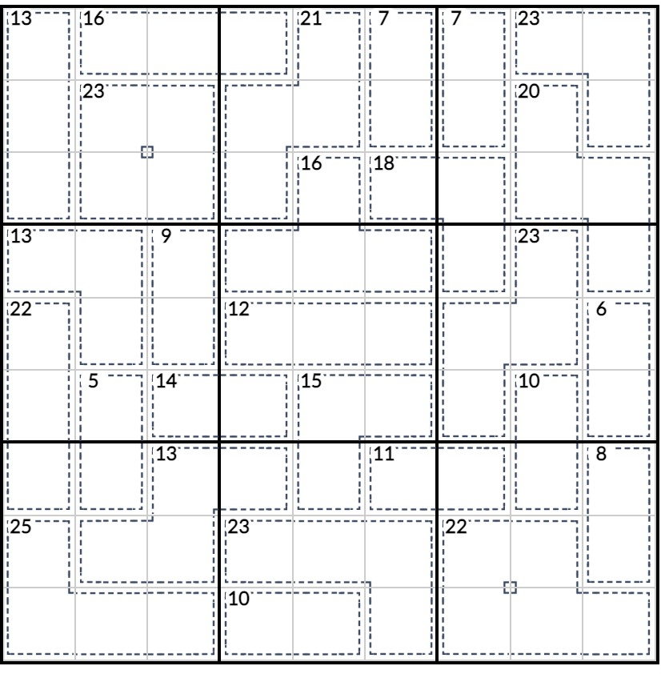

# 杀手+无缘数独
<!-- START doctoc generated TOC please keep comment here to allow auto update -->
<!-- DON'T EDIT THIS SECTION, INSTEAD RE-RUN doctoc TO UPDATE -->
## 目录

- [规则](#%E8%A7%84%E5%88%99)
  - [标签](#%E6%A0%87%E7%AD%BE)
- [题型名](#%E9%A2%98%E5%9E%8B%E5%90%8D)
- [题库](#%E9%A2%98%E5%BA%93)
  - [微信小程序](#%E5%BE%AE%E4%BF%A1%E5%B0%8F%E7%A8%8B%E5%BA%8F)

<!-- END doctoc generated TOC please keep comment here to allow auto update -->

## 规则

| 序号  | 限制区域 | 限制规则                                | 备注  |
|:---:|:----:|:------------------------------------|:---:|
|  1  |  行   | [1~9填充]                             |     |
|  2  |  列   | [1~9填充]                             |     |
|  3  |  宫   | [1~9填充]                             |     |
|  4  | 计算框  | [1~9不重复]  提示数 `S`：计算框内所有数字的和为 S |     |
|  5  |  全盘  | 对于任意格，其[邻格] ≠ 当前格                   | 无标  |

### 标签

- #计算/加法
- #士步限制

## 题型名

- 杀手无缘数独

## 题库

### 微信小程序

- 三思数独

[1~9填充]: ../../../rules/rules.md#1to9填充

[1~9不重复]: ../../../rules/rules.md#1to9不重复

[邻格]: ../../../rules/rules.md#邻格
