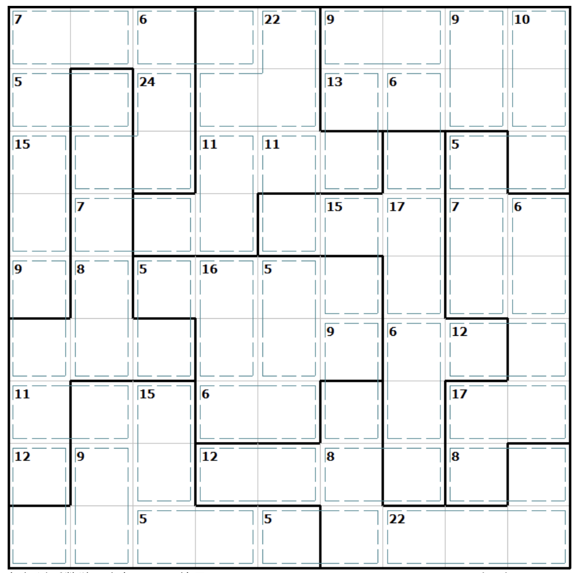

# 杀手+锯齿数独

## 规则

| 序号  | 限制区域 | 限制规则                                |
|:---:|:----:|:------------------------------------|
|  1  |  行   | [1~9填充]                             |
|  2  |  列   | [1~9填充]                             |
|  3  | 异形宫  | [1~9填充]                             |
|  4  | 计算框  | [1~9不重复]  提示数 `S`：计算框内所有数字的和为 S |

## 题库

### 在线题库

- [有一个数独](https://shudu.one/killer-sudoku.php)
- [Simon Tatham's Portable Puzzle Collection](https://www.chiark.greenend.org.uk/~sgtatham/puzzles/js/solo.html)

[1~9填充]: ../../../rules.md#1to9填充
[1~9不重复]: ../../../rules.md#1to9不重复
