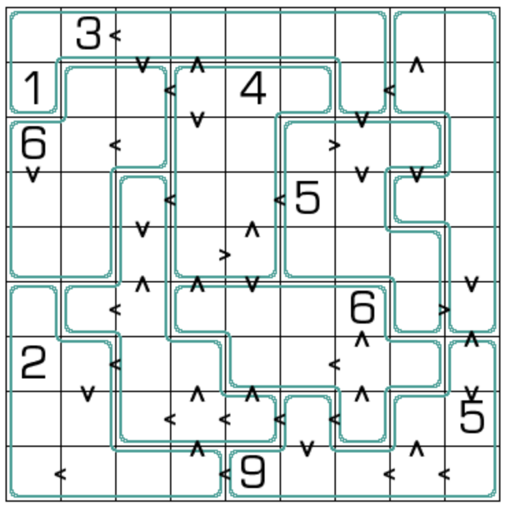

## 规则
| 序号 | 限制区域 | 限制规则 | 备注 |
| :---: | :---: | :--- | :--- |
| 1 | 行 | [1~9填充] | |
| 2 | 列 | [1~9填充] | |
| 3 | 异形宫 | [1~9填充] | |
| 4 | 标记边 | 标记两侧的[共边邻格] - 满足 `>` 的大小关系（即满足[数比]约束） - 所属行/列至少有 1 个盘外[摩天楼观测数] 是两格差值 | 全标 |

## 题库
- [独·数之道](http://www.sudokufans.org.cn/lx/game.index.php?type=lcj) 【需要登录】

[1~9填充]: ../../../rules.md#1~9填充
[共边邻格]: ../../../rules.md#共边邻格
[数比]: ../../../rules.md#数比
[摩天楼观测数]: ../../../rules.md#摩天楼观测数