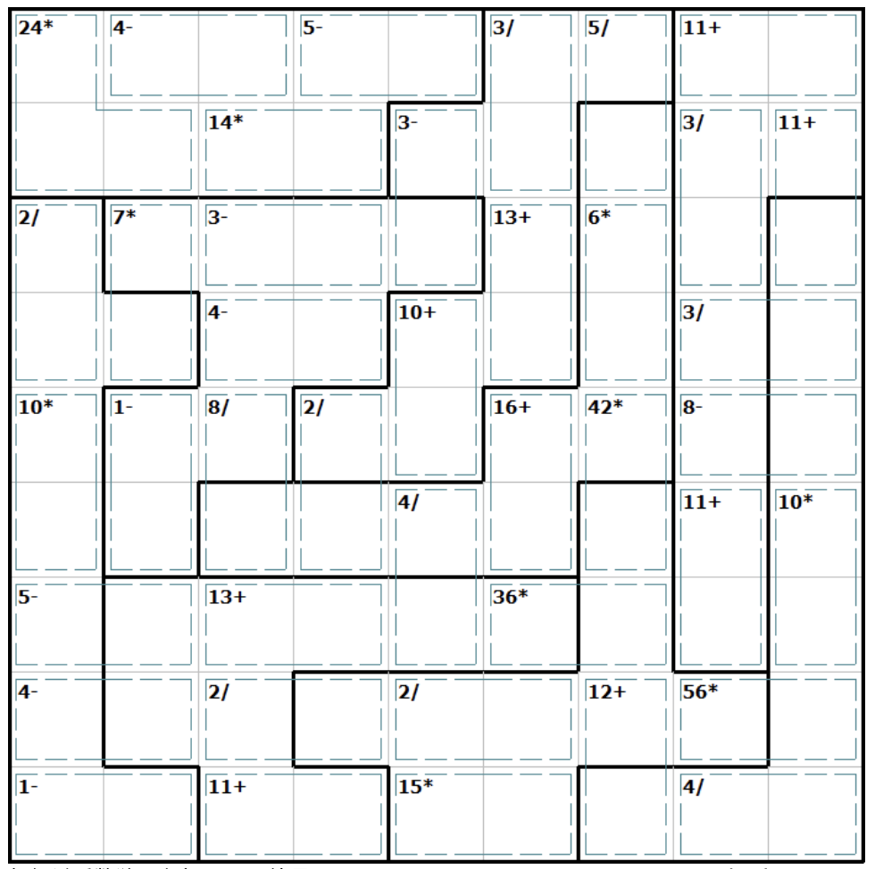

# 肯肯+锯齿数独
<!-- START doctoc generated TOC please keep comment here to allow auto update -->
<!-- DON'T EDIT THIS SECTION, INSTEAD RE-RUN doctoc TO UPDATE -->
## 目录

- [规则](#%E8%A7%84%E5%88%99)
- [题库](#%E9%A2%98%E5%BA%93)
  - [在线题库](#%E5%9C%A8%E7%BA%BF%E9%A2%98%E5%BA%93)

<!-- END doctoc generated TOC please keep comment here to allow auto update -->

## 规则

| 序号  | 限制区域 | 限制规则                                               |
|:---:|:----:|:---------------------------------------------------|
|  1  |  行   | [1~9填充]                                           |
|  2  |  列   | [1~9填充]                                           |
|  3  | 异形宫  | [1~9填充]                                           |
|  4  | 计算框  | [1~9不重复]  提示数 `R[+-*/]`：计算框内所有数字经过指定运算后，结果为 R |

## 题库

### 在线题库

- [有一个数独](https://shudu.one/killer-sudoku.php)

[1~9填充]: ../../../rules.md#1to9填充
[1~9不重复]: ../../../rules.md#1to9不重复
