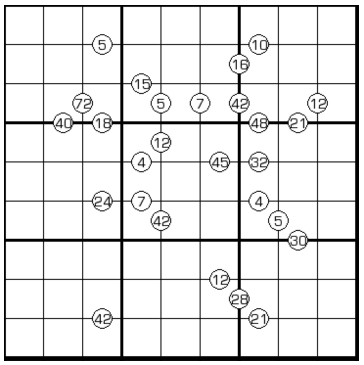

# 跨栏马数独

## 规则

| 序号  |  限制区域  | 限制规则                                         | 备注  |
|:---:|:------:|:---------------------------------------------|:----|
|  1  |   行    | [1~9填充]                                      |     |
|  2  |   列    | [1~9填充]                                      |     |
|  3  |   宫    | [1~9填充]                                      |     |
|  4  | 提示数（边） | 标记位为某个数的[马步]中心 提示数 `P`：标记位两侧[共边邻格]的乘积为 P | 全标  |

## 题库

### 在线题库

- [独·数之道](http://www.sudokufans.org.cn/lx/game.index.php?type=ym2) 【需要登录】

[1~9填充]: ../../../rules.md#1to9填充

[共边邻格]: ../../../rules.md#共边邻格

[马步]: ../../../rules.md#马步
