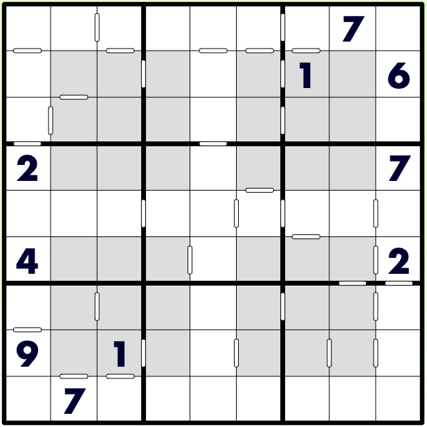

# 连续+窗口数独
<!-- START doctoc generated TOC please keep comment here to allow auto update -->
<!-- DON'T EDIT THIS SECTION, INSTEAD RE-RUN doctoc TO UPDATE -->

<!-- END doctoc generated TOC please keep comment here to allow auto update -->

## 规则

| 序号  | 限制区域 | 限制规则                        |  备注   |
|:---:|:----:|:----------------------------|:-----:|
|  1  |  行   | [1~9填充]                     |       |
|  2  |  列   | [1~9填充]                     |       |
|  3  |  宫   | [1~9填充]                     | 9 个宫  |
|  4  |  窗口  | [1~9填充]                     | 4 个窗口 |
|  5  | 标记边  | 标记边两侧的[共边邻格]差为 1（即满足[连续]约束） |  全标   |

### 标签

- #计算/减法/连续
- #额外宫/窗口

## 题型名

- 连续+窗口数独
- Kravitz Sudoku

## 题库

### 在线题库

- [KrazyDad](https://krazydad.com/play/kravitz/)

[1~9填充]: ../../../rules/rules.md#1to9填充

[共边邻格]: ../../../../../../rules/rules.md#共边邻格

[连续]: ../../../../../../rules/rules.md#连续
