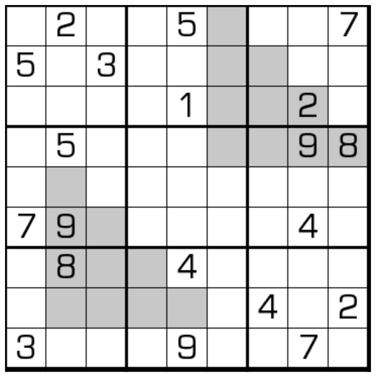

# 连续+重现数独
<!-- START doctoc generated TOC please keep comment here to allow auto update -->
<!-- DON'T EDIT THIS SECTION, INSTEAD RE-RUN doctoc TO UPDATE -->

<!-- END doctoc generated TOC please keep comment here to allow auto update -->

## 规则

| 序号  | 限制区域 | 限制规则                      |
|:---:|:----:|:--------------------------|
|  1  |  行   | [1~9填充]                   |
|  2  |  列   | [1~9填充]                   |
|  3  |  宫   | [1~9填充]                   |
|  4  | 标记区域 | 2 个标记区域图形相同，对应位置的两格差为 `1` |

### 标签

- #计算/减法/连续
- #克隆

## 题型名

- 连续+重现数独
- Consecutive Clone Sudoku

## 题库

### 在线题库

- [独·数之道](http://www.sudokufans.org.cn/lx/game.index.php?type=rp) 【需要登录】

[1~9填充]: ../../../rules/rules.md#1to9填充
