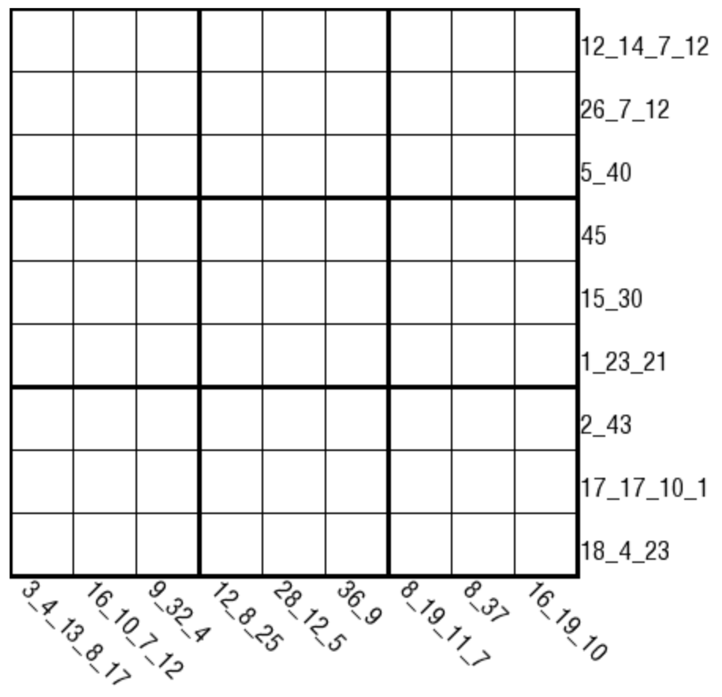

# 连续分段和
<!-- START doctoc generated TOC please keep comment here to allow auto update -->
<!-- DON'T EDIT THIS SECTION, INSTEAD RE-RUN doctoc TO UPDATE -->

<!-- END doctoc generated TOC please keep comment here to allow auto update -->

## 规则

| 序号 | 限制区域 | 限制规则 | 备注 |
| :---: | :---: | :--- | :--- |
| 1 | 行 | [1~9填充] | |
| 2 | 列 | [1~9填充] | |
| 3 | 宫 | [1~9填充] | |
| 4 | 提示数（盘外) | 以[正交连续]标记为界，本行/列被分隔为多段 提示数 `A[_B_C_D_E_F_G_H_I]`：依次分别是每段的和 | 有 1-9 段 |

## 题型名

- 分段和数独

## 题库

### 在线题库

- [独·数之道](http://www.sudokufans.org.cn/lx/game.index.php?type=fdh) 【需要登录】

[1~9填充]: ../../../rules/rules.md#1to9填充
[正交连续]: ../../../rules/rules.md#正交连续
