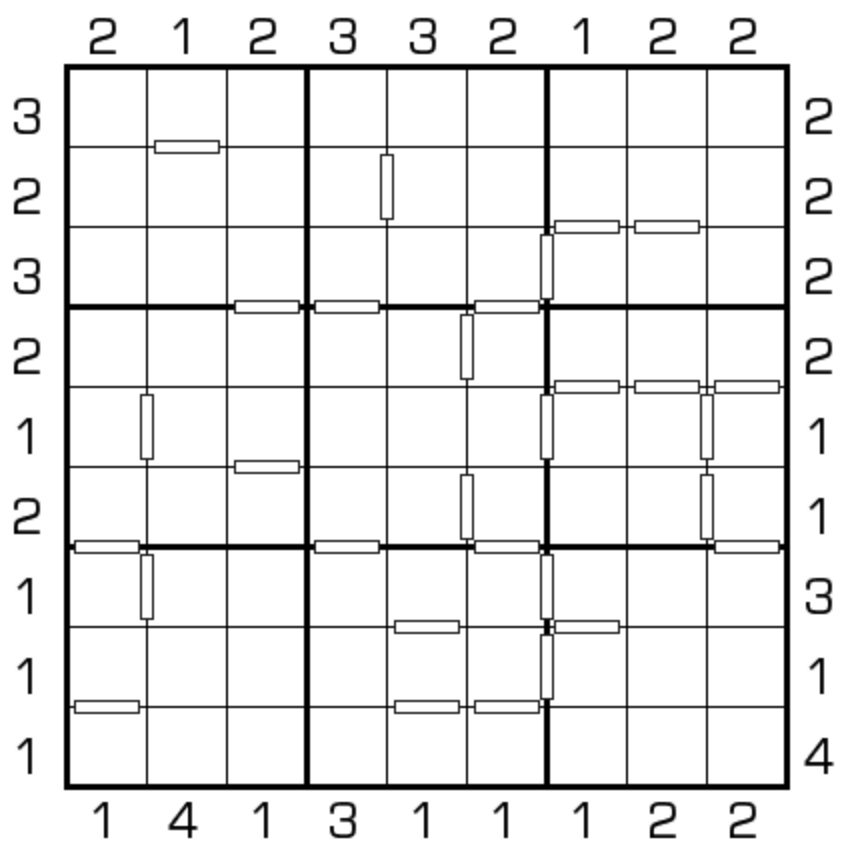

# 连遮楼数独
<!-- START doctoc generated TOC please keep comment here to allow auto update -->
<!-- DON'T EDIT THIS SECTION, INSTEAD RE-RUN doctoc TO UPDATE -->
## 目录

- [规则](#%E8%A7%84%E5%88%99)
- [题库](#%E9%A2%98%E5%BA%93)
  - [在线题库](#%E5%9C%A8%E7%BA%BF%E9%A2%98%E5%BA%93)

<!-- END doctoc generated TOC please keep comment here to allow auto update -->

## 规则

| 序号  |  限制区域   | 限制规则                                                      | 备注       |
|:---:|:-------:|:----------------------------------------------------------|:---------|
|  1  |    行    | [1~9填充]                                                   |          |
|  2  |    列    | [1~9填充]                                                   |          |
|  3  |    宫    | [1~9填充]                                                   |          |
|  4  |   标记边   | 标记边两侧的[共边邻格]差为 1（即满足[连续]约束）                               | 全标       |
|  5  | 提示数（盘外） | [正交连续]标记是无限高的`墙` 提示数 `M`：该（观测位，向盘内方向）获得的[摩天楼观测数]为 `M` | `墙`不是`楼` |

## 题库

### 在线题库

- [独·数之道](http://www.sudokufans.org.cn/lx/game.index.php?type=cnmt) 【需要登录】

[1~9填充]: ../../../rules.md#1to9填充
[共边邻格]: ../../../rules.md#共边邻格
[连续]: ../../../rules.md#连续
[正交连续]: ../../../rules.md#正交连续
[摩天楼观测数]: ../../../rules.md#摩天楼观测数
