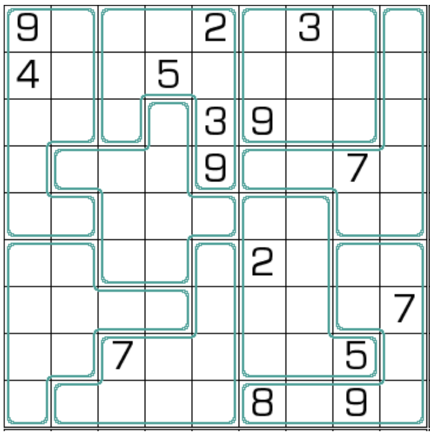

# 规则
| 序号 | 限制区域 | 限制规则 | 备注 |
| :---: | :---: | :--- | :--- |
| 1 | 行 | [1~9填充] | |
| 2 | 列 | [1~9填充] | |
| 3 | 异形宫 | [1~9填充] | |
| 4 | 共边邻格（行） | 任意第 R 行的[共边邻格]满足 - 和 ≠ R - 差 ≠ R | 无标，N不和差 |
| 5 | 共边邻格（列） | 任意第 C 行的[共边邻格]满足 - 和 ≠ C - 差 ≠ C | 无标，N不和差 |
> 规则与 [锯齿+N和差数独] 相同（即无标的 [锯齿+N和差数独]）

# 题库

## 在线题库
- [独·数之道](http://www.sudokufans.org.cn/lx/game.index.php?type=nn2) 【需要登录】

[1~9填充]: ../../../rules.md#1to9填充
[共边邻格]: ../../../rules.md#共边邻格
[锯齿+N和差数独]: 锯齿+N和差数独.md