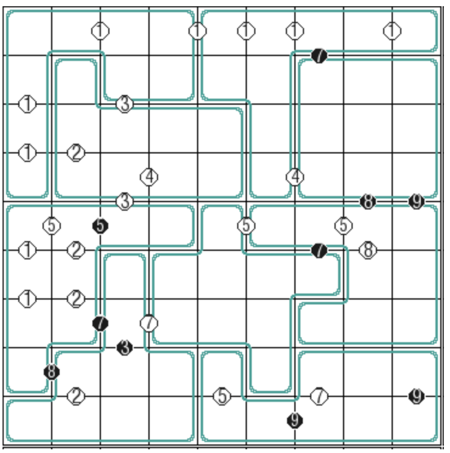

# 锯齿+N和差数独
<!-- START doctoc generated TOC please keep comment here to allow auto update -->
<!-- DON'T EDIT THIS SECTION, INSTEAD RE-RUN doctoc TO UPDATE -->
## 目录

- [规则](#%E8%A7%84%E5%88%99)
- [题库](#%E9%A2%98%E5%BA%93)
  - [在线题库](#%E5%9C%A8%E7%BA%BF%E9%A2%98%E5%BA%93)

<!-- END doctoc generated TOC please keep comment here to allow auto update -->

## 规则

| 序号 | 限制区域 | 限制规则 | 备注 |
| :---: | :---: | :--- | :--- |
| 1 | 行 | [1~9填充] | |
| 2 | 列 | [1~9填充] | |
| 3 | 异形宫 | [1~9填充] | |
| 4 | [共边邻格]（行） | 第 R 行的[共边邻格] - 和为 R：共边标记黑点 - 差为 R：共边标记白点 - 其他：不标记 | 全标，N和差 |
| 5 | [共边邻格]（列） | 第 C 行的[共边邻格] - 和为 C：共边标记黑点 - 差为 C：共边标记白点 - 其他：不标记 | 全标，N和差 |

## 题库

### 在线题库

- [独·数之道](http://www.sudokufans.org.cn/lx/game.index.php?type=nn) 【需要登录】

[1~9填充]: ../../../rules/rules.md#1to9填充
[共边邻格]: ../../../rules/rules.md#共边邻格
