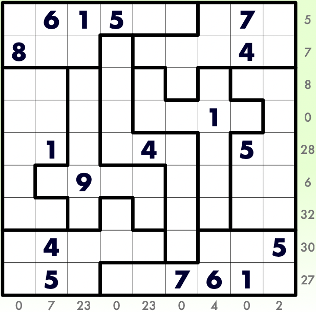

# 锯齿+三明治数独
<!-- START doctoc generated TOC please keep comment here to allow auto update -->
<!-- DON'T EDIT THIS SECTION, INSTEAD RE-RUN doctoc TO UPDATE -->

<!-- END doctoc generated TOC please keep comment here to allow auto update -->

## 规则

| 序号  |  限制区域   | 限制规则                                  |
|:---:|:-------:|:--------------------------------------|
|  1  |    行    | [1~9填充]                               |
|  2  |    列    | [1~9填充]                               |
|  3  |   异形宫   | [1~9填充]                               |
|  4  | 提示数（盘外） | 提示数`S`：当前位置向盘内看，`1`和`9`两格之间的所有数字和为`S` |

### 标签

- #计算/加法/连续位和/三明治
- #异形宫

## 题型名

- 锯齿+三明治数独
- Dagwood Sudoku

## 题库

### 在线题库

- [KrazyDad](https://krazydad.com/play/dagwood/)

[1~9填充]: ../../../rules/rules.md#1to9填充
