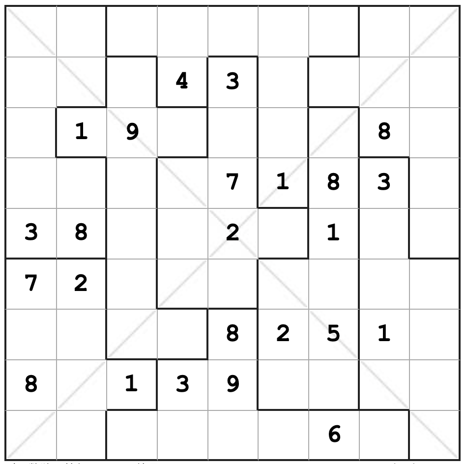

# 规则

| 序号  | 限制区域 | 限制规则    |
|:---:|:----:|:--------|
|  1  |  行   | [1~9填充] |
|  2  |  列   | [1~9填充] |
|  3  | 异形宫  | [1~9填充] |
|  4  | 对角线  | [1~9填充] |

# 别名
- 锯齿 X 数独

# 题库

## 在线题库
- [有一个数独](https://shudu.one/jigsaw-x-sudoku.php)
- [Simon Tatham's Portable Puzzle Collection](https://www.chiark.greenend.org.uk/~sgtatham/puzzles/js/solo.html)

[1~9填充]: ../../../rules.md#1~9填充