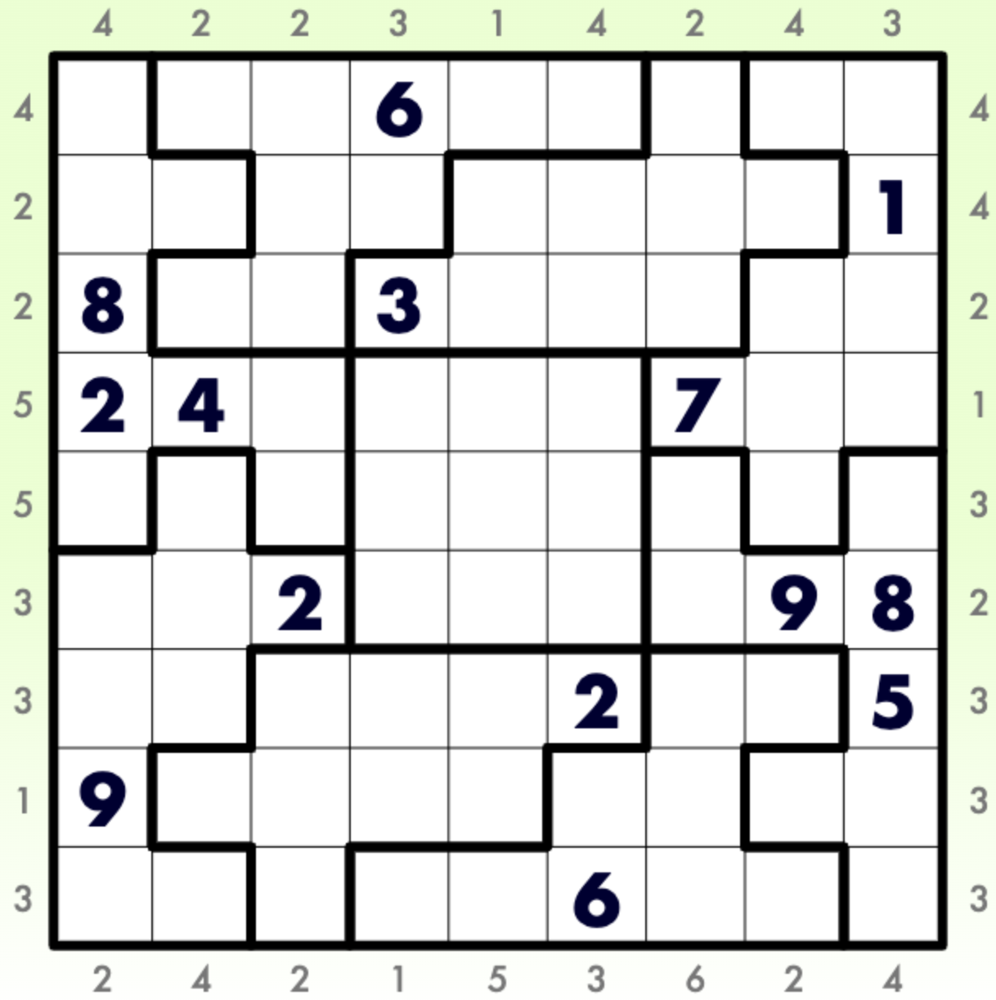

# 锯齿+摩天楼数独
<!-- START doctoc generated TOC please keep comment here to allow auto update -->
<!-- DON'T EDIT THIS SECTION, INSTEAD RE-RUN doctoc TO UPDATE -->

<!-- END doctoc generated TOC please keep comment here to allow auto update -->

## 规则

| 序号  |  限制区域   | 限制规则                                 |
|:---:|:-------:|:-------------------------------------|
|  1  |    行    | [1~9填充]                              |
|  2  |    列    | [1~9填充]                              |
|  3  |   异形宫   | [1~9填充]                              |
|  4  | 提示数（盘外） | 提示数 `M`：该（观测位，向盘内方向）获得的[摩天楼观测数]为 `M` |

### 标签

- #异形宫
- #比大小/摩天楼

## 题型名

- 锯齿+摩天楼数独
- Krazytown Sudoku

## 题库

### 在线题库

- [KrazyDad](https://krazydad.com/play/krazytown/)

[1~9填充]: ../../../rules/rules.md#1to9填充

[摩天楼观测数]: ../../../rules/rules.md#摩天楼观测数
