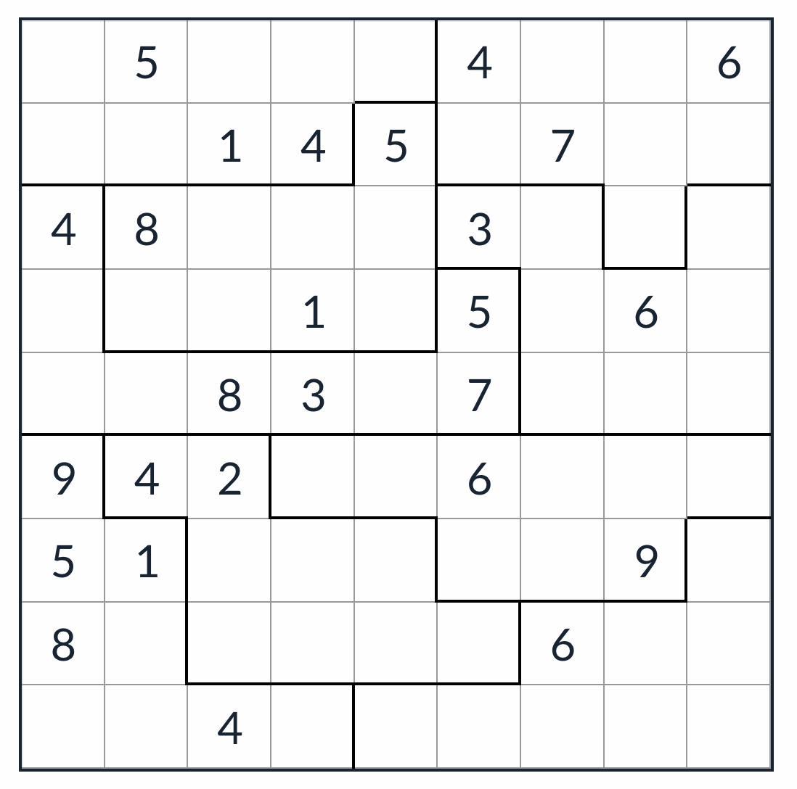

# 锯齿+无缘数独

<!-- START doctoc generated TOC please keep comment here to allow auto update -->
<!-- DON'T EDIT THIS SECTION, INSTEAD RE-RUN doctoc TO UPDATE -->

<!-- END doctoc generated TOC please keep comment here to allow auto update -->

## 规则

| 序号  | 限制区域 | 限制规则              | 备注  |
|:---:|:----:|:------------------|:---:|
|  1  |  行   | [1~9填充]           |     |
|  2  |  列   | [1~9填充]           |     |
|  3  | 异形宫  | [1~9填充]           |     |
|  4  |  全盘  | 对于任意格，其[邻格] ≠ 当前格 | 无标  |

### 标签

- #异形宫
- #邻格限制
- #士步限制

## 题型名

- 锯齿+无缘数独

## 题库

### 在线题库

- [GridPuzzle](https://cn.gridpuzzle.com/anti-king-jigsaw-sudoku/evil)

[1~9填充]: ../../../rules/rules.md#1to9填充

[邻格]: ../../../../../../rules/rules.md#邻格
