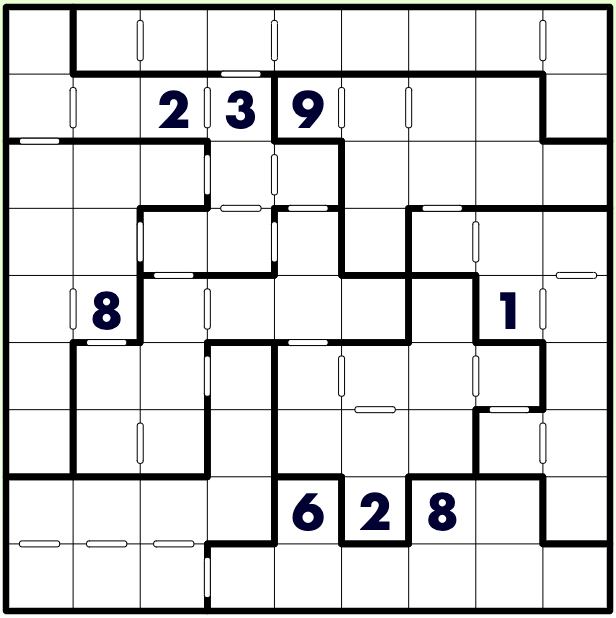

# 锯齿+连续数独

## 规则

| 序号  | 限制区域 | 限制规则                        | 备注  |
|:---:|:----:|:----------------------------|:---:|
|  1  |  行   | [1~9填充]                     |     |
|  2  |  列   | [1~9填充]                     |     |
|  3  | 异形宫  | [1~9填充]                     |     |
|  4  | 标记边  | 标记边两侧的[共边邻格]差为 1（即满足[连续]约束） | 全标  |

### 标签

- [[连续]]
- [[异形宫]]

## 题型名

- 锯齿+连续数独
- Jigsaw Consecutive Sudoku

## 题库

### 在线题库

- [KrazyDad](https://krazydad.com/play/jigcon/)

[1~9填充]: ../../../rules.md#1to9填充

[共边邻格]: ../../../../../../rules.md#共边邻格

[连续]: ../../../../../../rules.md#连续
