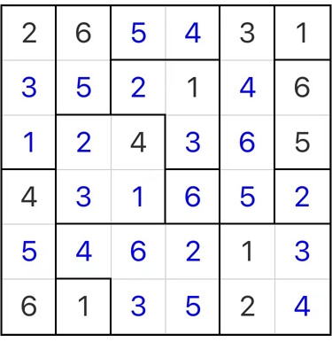

# 锯齿碎片数独

<!-- START doctoc generated TOC please keep comment here to allow auto update -->
<!-- DON'T EDIT THIS SECTION, INSTEAD RE-RUN doctoc TO UPDATE -->

<!-- END doctoc generated TOC please keep comment here to allow auto update -->

## 规则

| 序号  | 限制区域 | 限制规则                        |
|:---:|:----:|:----------------------------|
|  1  |  行   | [1~9填充]                     |
|  2  |  列   | [1~9填充]                     |
|  3  | 异形宫  | 满足[连续区间限制]，且数字不重复           |

### 标签

- #计算/减法/连续/连续区间
- #异形宫

## 题型名

- 锯齿碎片数独

## 题库

### 微信小程序

- 三思数独

[1~9填充]: ../../../rules/rules.md#1to9填充

[连续区间限制]: ../../../rules/rules.md#连续区间限制
