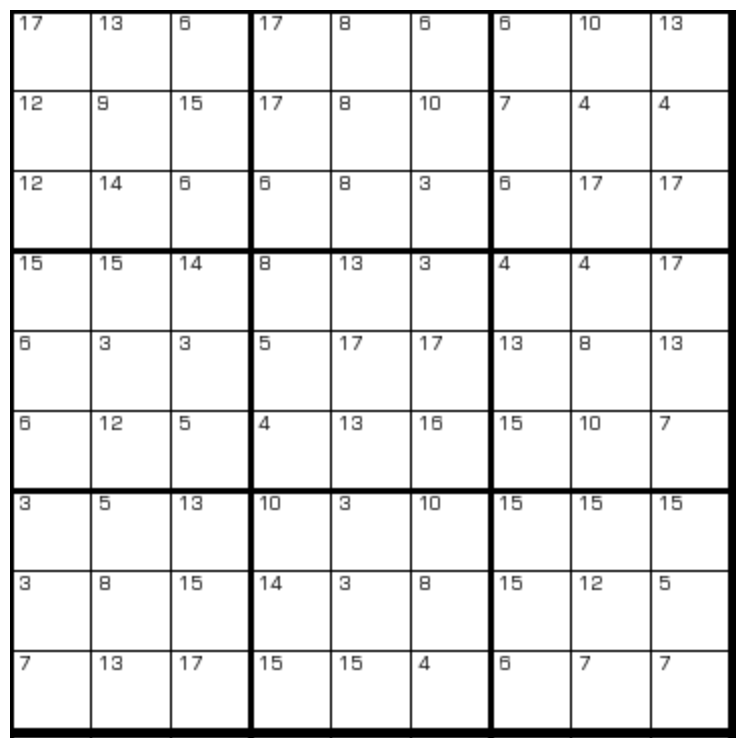

# 一加一数独
<!-- START doctoc generated TOC please keep comment here to allow auto update -->
<!-- DON'T EDIT THIS SECTION, INSTEAD RE-RUN doctoc TO UPDATE -->

<!-- END doctoc generated TOC please keep comment here to allow auto update -->

## 规则

| 序号  |  限制区域  | 限制规则                    |
|:---:|:------:|:------------------------|
|  1  |   行    | [1~9填充]                 |
|  2  |   列    | [1~9填充]                 |
|  3  |   宫    | [1~9填充]                 |
|  4  | 提示数（格） | 提示数`S`：当前格+某一[共边邻格] = S |

### 标签

- #计算/加法

## 题库

### 在线题库

- [独·数之道](http://www.sudokufans.org.cn/lx/game.index.php?type=1p1) 【需要登录】

[1~9填充]: ../../../../rules/rules.md#1to9填充

[共边邻格]: ../../../../rules/rules.md#共边邻格
