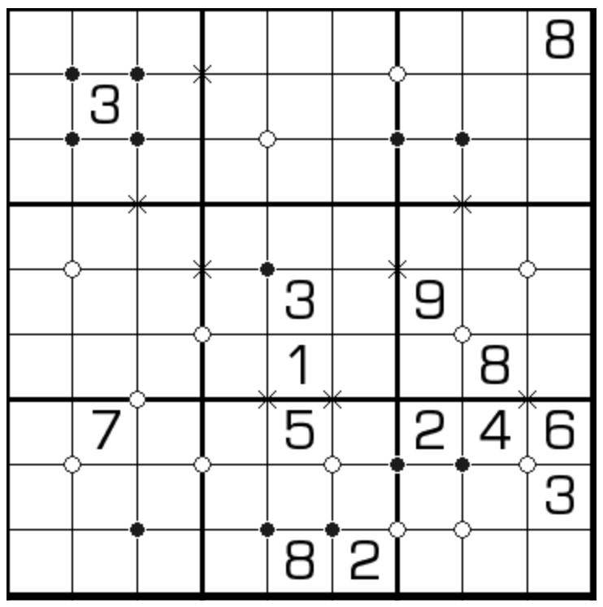

# 石头剪刀布
<!-- START doctoc generated TOC please keep comment here to allow auto update -->
<!-- DON'T EDIT THIS SECTION, INSTEAD RE-RUN doctoc TO UPDATE -->

<!-- END doctoc generated TOC please keep comment here to allow auto update -->

## 规则

| 序号 | 限制区域 | 限制规则 | 备注 |
| :---: | :---: | :--- | :---: |
| 1 | 行 | [1~9填充] | |
| 2 | 列 | [1~9填充] | |
| 3 | 宫 | [1~9填充] | |
| 4 | 标记顶点 | `X`：标记顶点周围四格 - 存在对角的数字相同 | 全标 |
| 5 | 标记顶点 | 黑点：标记顶点周围四格 - 不存在对角的数字相同 - 存在对角数字是两倍关系 | 全标 |
| 6 | 标记顶点 | 白点：标记顶点周围四格 - 不存在对角的数字相同 - 不存在对角数字是 2 倍关系 - 不存在对角数字是差为 1 | 全标 |

## 题库

### 在线题库

- [独·数之道](http://www.sudokufans.org.cn/lx/game.index.php?type=sjb) 【需要登录】

[1~9填充]: ../../../../../rules/rules.md#1to9填充
