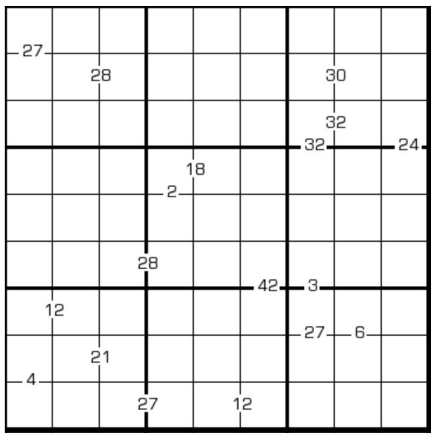

# 乘积数独
<!-- START doctoc generated TOC please keep comment here to allow auto update -->
<!-- DON'T EDIT THIS SECTION, INSTEAD RE-RUN doctoc TO UPDATE -->
## 目录

- [规则](#%E8%A7%84%E5%88%99)
- [题型名](#%E9%A2%98%E5%9E%8B%E5%90%8D)
- [题库](#%E9%A2%98%E5%BA%93)
  - [在线题库](#%E5%9C%A8%E7%BA%BF%E9%A2%98%E5%BA%93)
  - [微信小程序](#%E5%BE%AE%E4%BF%A1%E5%B0%8F%E7%A8%8B%E5%BA%8F)
- [扩展题型](#%E6%89%A9%E5%B1%95%E9%A2%98%E5%9E%8B)

<!-- END doctoc generated TOC please keep comment here to allow auto update -->

## 规则

| 序号  |  限制区域   | 限制规则                   |
|:---:|:-------:|:-----------------------|
|  1  |    行    | [1~9填充]                |
|  2  |    列    | [1~9填充]                |
|  3  |    宫    | [1~9填充]                |
|  4  | 提示数（边）  | 提示数`P`：两侧[共边邻格]的乘积为 P  |
|  5  | 提示数（顶点） | 提示数 `/P`：左下格与右上格的乘积为 P |
|  6  | 提示数（顶点） | 提示数 `\P`：左上格和右下格的乘积为 P |

## 题型名

- 乘积数独
- 小九九数独
- Product Sudoku

## 题库

### 在线题库

- [独·数之道](http://www.sudokufans.org.cn/lx/game.index.php?type=99) 【需要登录】
- [今日数独]【选题不便】

### 微信小程序

- 数独星空

## 扩展题型

- [跨栏马数独](../../混合类/跨栏马数独.md)

[1~9填充]: ../../../../rules.md#1to9填充

[共边邻格]: ../../../../rules.md#共边邻格

[今日数独]: https://cn.sudoku.today/g-products-sudoku/
