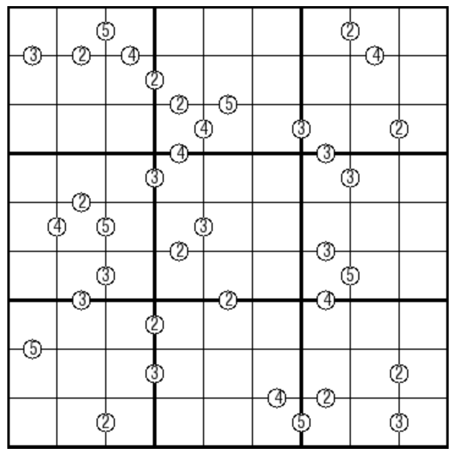

# 倍数数独
<!-- START doctoc generated TOC please keep comment here to allow auto update -->
<!-- DON'T EDIT THIS SECTION, INSTEAD RE-RUN doctoc TO UPDATE -->

<!-- END doctoc generated TOC please keep comment here to allow auto update -->

## 规则

| 序号  |  限制区域  | 限制规则                        | 备注  |
|:---:|:------:|:----------------------------|:---:|
|  1  |   行    | [1~9填充]                     |     |
|  2  |   列    | [1~9填充]                     |     |
|  3  |   宫    | [1~9填充]                     |     |
|  4  | 提示数（边） | 提示数`Q`：两侧[共边邻格]的商为整数，且商 = Q | 全标  |

### 标签

- #计算/除法

## 题型名

- 倍数数独

## 题库

### 在线题库

- [独·数之道](http://www.sudokufans.org.cn/lx/game.index.php?type=hb2) 【需要登录】

## 升级题型

- [因何数独](单标类/因何数独.md)

[1~9填充]: ../../../../rules/rules.md#1to9填充
[共边邻格]: ../../../../rules/rules.md#共边邻格
