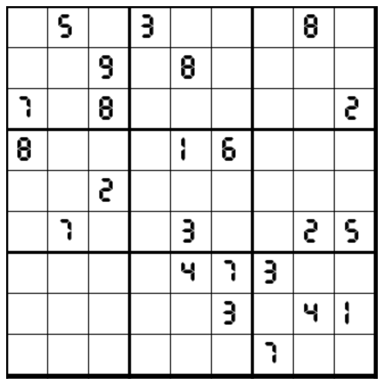

# 倒算式数独
<!-- START doctoc generated TOC please keep comment here to allow auto update -->
<!-- DON'T EDIT THIS SECTION, INSTEAD RE-RUN doctoc TO UPDATE -->
## 目录

- [规则](#%E8%A7%84%E5%88%99)
- [题库](#%E9%A2%98%E5%BA%93)
  - [在线题库](#%E5%9C%A8%E7%BA%BF%E9%A2%98%E5%BA%93)

<!-- END doctoc generated TOC please keep comment here to allow auto update -->

## 规则

<!-- markdownlint-disable MD013 -->

| 序号  | 限制区域 | 限制规则                        | 备注                                                                      |
|:---:|:----:|:----------------------------|:------------------------------------------------------------------------|
|  1  |  行   | [1~9填充]                     |                                                                         |
|  2  |  列   | [1~9填充]                     |                                                                         |
|  3  |  宫   | [1~9填充]                     |                                                                         |
|  4  |  全盘  | 全盘存在一个倒着的算式：两位数 + 两位数 = 三位数 | `1258`：不变  `6`：变9  `9`：变6  `347`：不出现  例：62+96=158![倒算式] |

<!-- markdownlint-enable MD013 -->

## 题库

### 在线题库

- [独·数之道](http://www.sudokufans.org.cn/lx/game.index.php?type=ss) 【需要登录】

[倒算式]: http://www.sudokufans.org.cn/images/ss.png

[1~9填充]: ../../../../rules/rules.md#1to9填充
