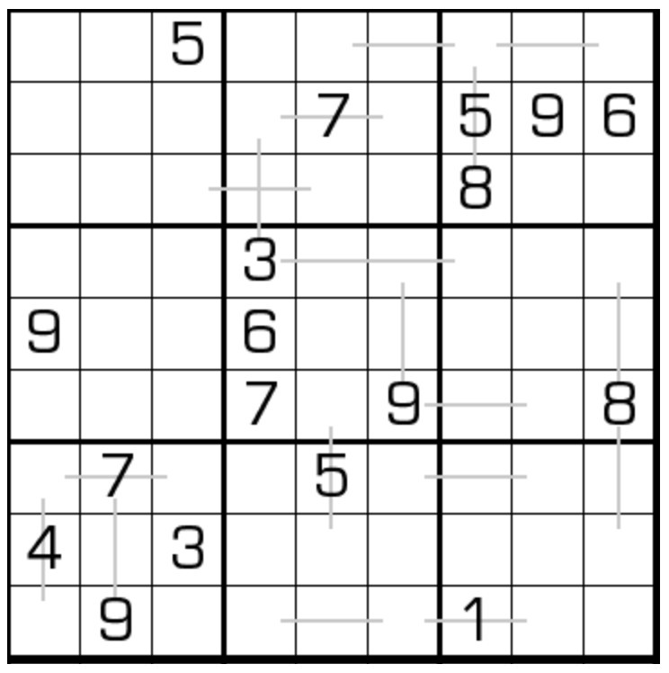

## 规则
| 序号 | 限制区域 | 限制规则 | 备注 |
| :---: | :---: | :--- | :---: |
| 1 | 行 | [1~9填充] | |
| 2 | 列 | [1~9填充] | |
| 3 | 宫 | [1~9填充] | |
| 4 | 标记区域 | 标记区域凡连续3 格（从上到下/从左到右）ABC，满足：`A+B=C` 或 `A-B=C` | 全标 |

## 题库
- [独·数之道](http://www.sudokufans.org.cn/lx/game.index.php?type=z4) 【需要登录】

[1~9填充]: ../../../../../../rules.md#1~9填充
[共边邻格]: ../../../../../../rules.md#共边邻格