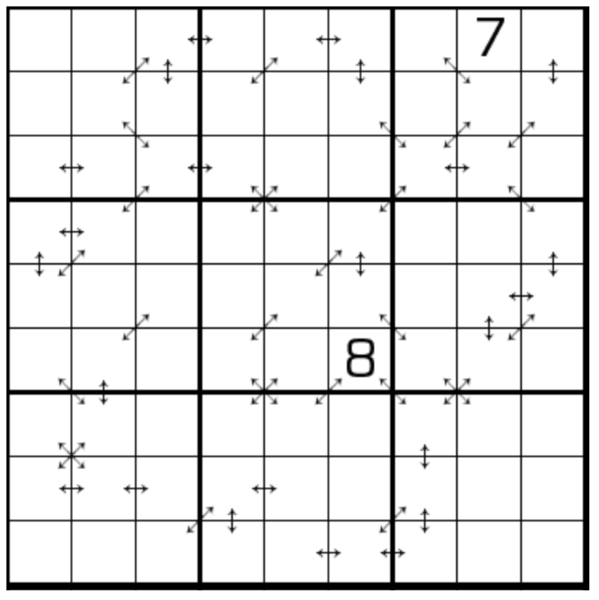

# 因数数独
<!-- START doctoc generated TOC please keep comment here to allow auto update -->
<!-- DON'T EDIT THIS SECTION, INSTEAD RE-RUN doctoc TO UPDATE -->

<!-- END doctoc generated TOC please keep comment here to allow auto update -->

## 规则

| 序号  | 限制区域 | 限制规则                     | 备注  |
|:---:|:----:|:-------------------------|:---:|
|  1  |  行   | [1~9填充]                  |     |
|  2  |  列   | [1~9填充]                  |     |
|  3  |  宫   | [1~9填充]                  |     |
|  4  | 标记区域 | 标记区域的[邻格]都不是 `1`，且存在倍数关系 | 全标  |

## 题库

### 在线题库

- [独·数之道](http://www.sudokufans.org.cn/lx/game.index.php?type=29) 【需要登录】

## 特色题型

- [因何数独](因何数独.md)

[1~9填充]: ../../../../../rules/rules.md#1to9填充
[邻格]: ../../../../../rules/rules.md#邻格
