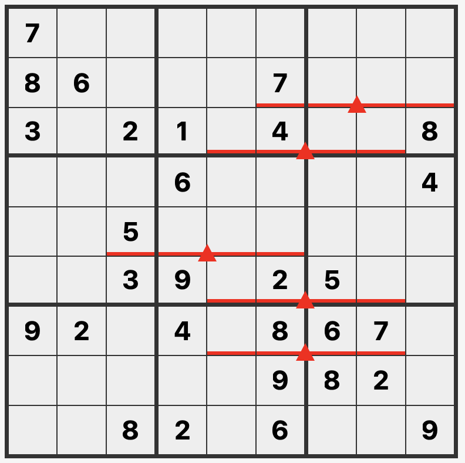

# 天平数独

## 规则

| 序号  | 限制区域 | 限制规则        |      备注      |
|:---:|:----:|:------------|:------------:|
|  1  |  行   | [1~9填充]     |              |
|  2  |  列   | [1~9填充]     |              |
|  3  |  宫   | [1~9填充]     |              |
|  4  | 标记区域 | 标记区域的保持天平平衡 | 三角标记两侧的数字和相等 |

### 微信小程序

- 破解数独

[1~9填充]: ../../../../../rules.md#1to9填充
