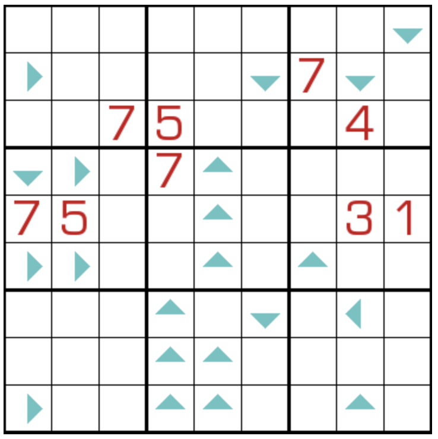

# 寻9数独
<!-- START doctoc generated TOC please keep comment here to allow auto update -->
<!-- DON'T EDIT THIS SECTION, INSTEAD RE-RUN doctoc TO UPDATE -->

<!-- END doctoc generated TOC please keep comment here to allow auto update -->

## 规则

| 序号  | 限制区域 | 限制规则                                    | 备注  |
|:---:|:----:|:----------------------------------------|:---:|
|  1  |  行   | [1~9填充]                                 |     |
|  2  |  列   | [1~9填充]                                 |     |
|  3  |  宫   | [1~9填充]                                 |     |
|  4  | 标记格  | 从标记格沿标记方向前进 `X` 格为 `9` - 标记格数字为 `X` | 全标  |

## 题型名

- 寻9数独
- 找9数独
- Search Nine Sudoku

## 题库

### 在线题库

- [独·数之道](http://www.sudokufans.org.cn/lx/game.index.php?type=find9) 【需要登录】
- [今日数独]【选题不便】

### 微信小程序

- ~~变形数独~~

[1~9填充]: ../../../../../rules/rules.md#1to9填充

[今日数独]: https://cn.sudoku.today/g-search-9-sudoku/
