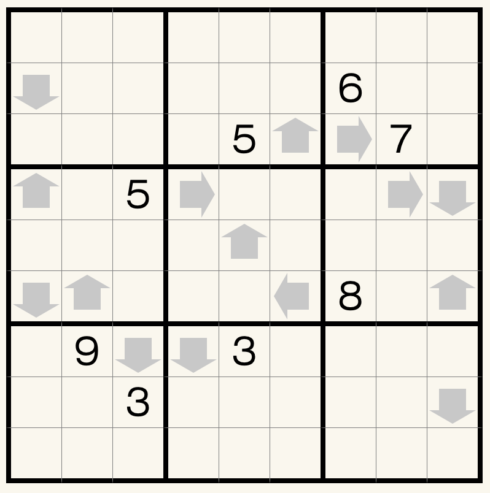
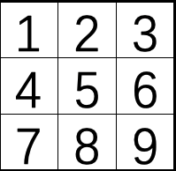

## 规则
| 序号 | 限制区域 | 限制规则 | 备注 |
| :---: | :---: | :--- | :---: |
| 1 | 行 | [1~9填充] | |
| 2 | 列 | [1~9填充] | |
| 3 | 宫 | [1~9填充] | |
| 4 | 标记格 | 从标记格沿标记方向前进 `X` 格为 P - 标记格数字为 `X` - 标记格在宫内位号为 P  | 全标 |

### 宫内位号

## 微信小程序
- 变形数独

[1~9填充]: ../../../../../../rules.md#1~9填充