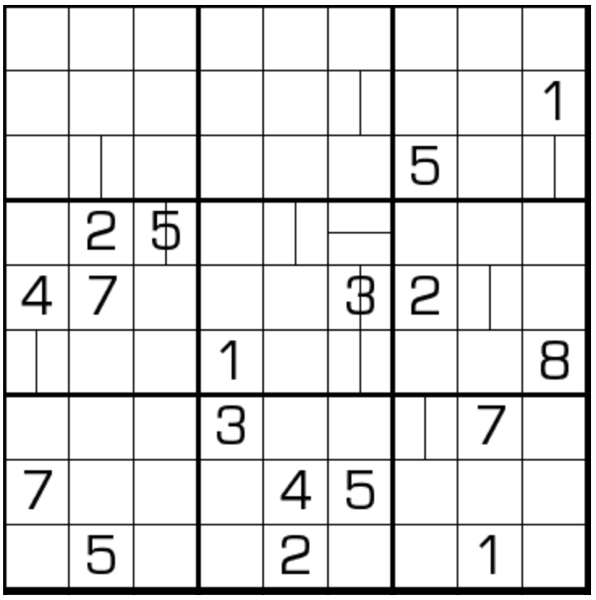

# 规则
| 序号 | 限制区域 | 限制规则 | 备注 |
| :---: | :---: | :--- | :---: |
| 1 | 行 | [1~9填充] | |
| 2 | 列 | [1~9填充] | |
| 3 | 宫 | [1~9填充] | |
| 4 | 标记格 | `——`：标记格 = 左右两格的算数平均数 | 全标 |
| 5 | 标记格 | `｜` ：标记格 = 上下两格的算数平均数 | 全标 |

# 题库

## 在线题库
- [独·数之道](http://www.sudokufans.org.cn/lx/game.index.php?type=avg) 【需要登录】

[1~9填充]: ../../../../../../rules.md#1to9填充