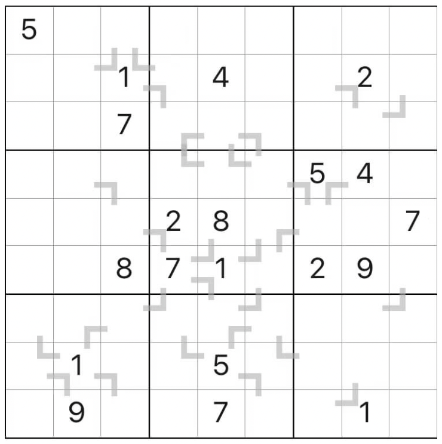

# 拐角和数独
<!-- START doctoc generated TOC please keep comment here to allow auto update -->
<!-- DON'T EDIT THIS SECTION, INSTEAD RE-RUN doctoc TO UPDATE -->

<!-- END doctoc generated TOC please keep comment here to allow auto update -->

## 规则

| 序号  | 限制区域 | 限制规则                        | 备注  |
|:---:|:----:|:----------------------------|:---:|
|  1  |  行   | [1~9填充]                     |     |
|  2  |  列   | [1~9填充]                     |     |
|  3  |  宫   | [1~9填充]                     |     |
|  4  | 标记线  | 标记的拐角 3 格中，有 1 个数是另外 2 个数的和 | 全标  |

### 标签

- #计算/加法
- #拐角限制

## 题库

### 微信小程序

- 三思数独

[1~9填充]: ../../../../../rules/rules.md#1to9填充
