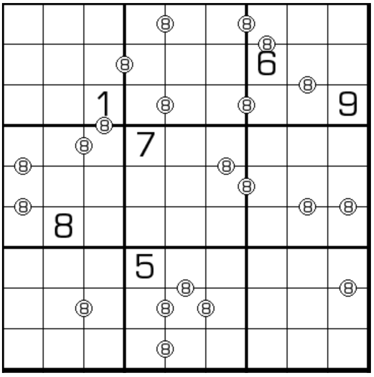

# 算8数独
<!-- START doctoc generated TOC please keep comment here to allow auto update -->
<!-- DON'T EDIT THIS SECTION, INSTEAD RE-RUN doctoc TO UPDATE -->

<!-- END doctoc generated TOC please keep comment here to allow auto update -->

## 规则

| 序号  | 限制区域 | 限制规则                         | 备注  |
|:---:|:----:|:-----------------------------|:---:|
|  1  |  行   | [1~9填充]                      |     |
|  2  |  列   | [1~9填充]                      |     |
|  3  |  宫   | [1~9填充]                      |     |
|  4  | 标记边  | 标记边两侧的[共边邻格]通过`+-*`的计算结果 = 8 | 全标  |

## 题型名

- 算8数独
- 回答8数独

## 题库

### 在线题库

- [独·数之道](http://www.sudokufans.org.cn/lx/game.index.php?type=c8) 【需要登录】
- [今日数独]【选题不便】

[1~9填充]: ../../../../../rules/rules.md#1to9填充

[共边邻格]: ../../../../../rules/rules.md#共边邻格

[今日数独]: https://cn.sudoku.today/g-answer-8-sudoku/
