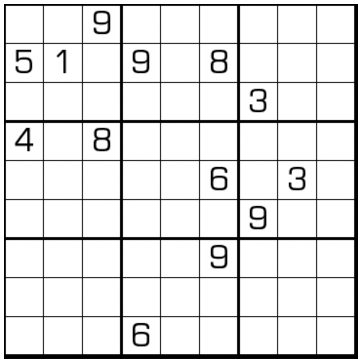

# 不连续数独
<!-- START doctoc generated TOC please keep comment here to allow auto update -->
<!-- DON'T EDIT THIS SECTION, INSTEAD RE-RUN doctoc TO UPDATE -->

<!-- END doctoc generated TOC please keep comment here to allow auto update -->

## 规则

| 序号  | 限制区域 | 限制规则                       | 备注  |
|:---:|:----:|:---------------------------|:---:|
|  1  |  行   | [1~9填充]                    |     |
|  2  |  列   | [1~9填充]                    |     |
|  3  |  宫   | [1~9填充]                    |     |
|  4  |  全盘  | 任意[共边邻格]的差 ≠ 1（即不满足[连续]约束） | 无标  |

> 规则与 [全标连续数独] 相同（即无标的 [全标连续数独]）

## 题型名

- 不连续数独
- Non-consecutive Sudoku

## 题库

### 在线题库

- [三思数独]
- [独·数之道](http://www.sudokufans.org.cn/lx/game.index.php?type=nc) 【需要登录】
- [今日数独]【选题不便】

### 微信小程序

- 三思数独
- 数独星空

## 技巧

- 多分支
  - 双值格连续候选
    - 
  - 三值格连续候选
    - 
    - 夹数原理：258全覆盖
- 区块
  - [共边邻格]区块
  - [对角邻格]区块
  - 间隔区块
  - 3 连格区块
- 数对
  - 对角覆盖
  - 三连禁原理
  - 3 连格放置连续数对
  - 4 连格放置连续 4 数组

## 特色题型

- [不连续螺旋](不连续螺旋.md)

> 引用：
>
> - Bilibili：[9：连续数独和不连续数独（中）](https://www.bilibili.com/read/cv10137783)

[全标连续数独]: 全标连续数独.md

[1~9填充]: ../../../../../../rules/rules.md#1to9填充

[连续]: ../../../../../../rules/rules.md#连续

[共边邻格]: ../../../../../../rules/rules.md#共边邻格

[对角邻格]: ../../../../../../rules/rules.md#对角邻格

[今日数独]: https://cn.sudoku.today/g-non-consecutive-sudoku/

[三思数独]: https://www.12634.com/sudoku/non_consecutive9x9/level5
