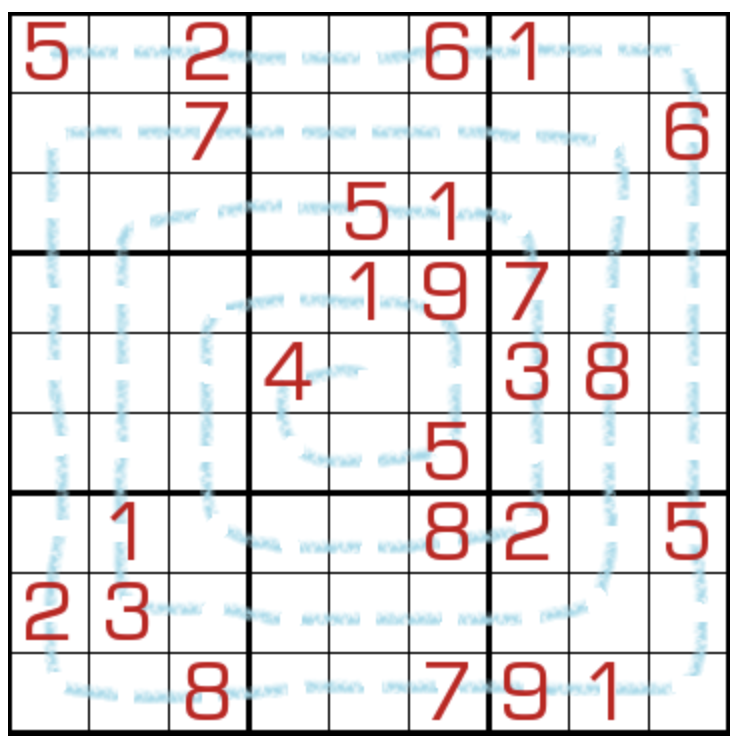

# 不连续螺旋
<!-- START doctoc generated TOC please keep comment here to allow auto update -->
<!-- DON'T EDIT THIS SECTION, INSTEAD RE-RUN doctoc TO UPDATE -->
## 目录

- [规则](#%E8%A7%84%E5%88%99)
- [题型名](#%E9%A2%98%E5%9E%8B%E5%90%8D)
- [题库](#%E9%A2%98%E5%BA%93)
  - [在线题库](#%E5%9C%A8%E7%BA%BF%E9%A2%98%E5%BA%93)
  - [微信小程序](#%E5%BE%AE%E4%BF%A1%E5%B0%8F%E7%A8%8B%E5%BA%8F)

<!-- END doctoc generated TOC please keep comment here to allow auto update -->

## 规则

| 序号  | 限制区域 | 限制规则                           | 备注  |
|:---:|:----:|:-------------------------------|:---:|
|  1  |  行   | [1~9填充]                        |     |
|  2  |  列   | [1~9填充]                        |     |
|  3  |  宫   | [1~9填充]                        |     |
|  4  | 共边邻格 | 螺旋线穿过的[共边邻格]的差 ≠ 1（即不满足[连续]约束） | 无标  |

## 题型名

- 蜗牛数独

## 题库

### 在线题库

- [独·数之道](http://www.sudokufans.org.cn/lx/game.index.php?type=spiral) 【需要登录】

### 微信小程序

- ~~变形数独~~

[1~9填充]: ../../../../../../rules/rules.md#1to9填充
[连续]: ../../../../../../rules/rules.md#连续
[共边邻格]: ../../../../../../rules/rules.md#共边邻格
