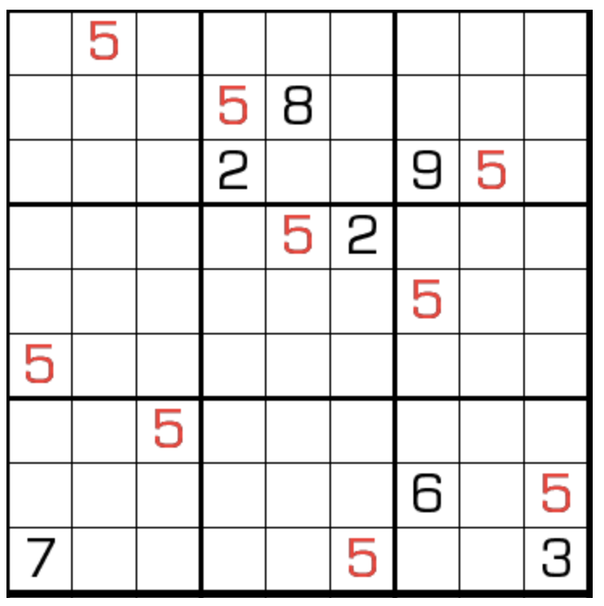

# 规则
| 序号  | 限制区域 | 限制规则                                      |           备注            |
|:---:|:----:|:------------------------------------------|:-----------------------:|
|  1  |  行   | [1~9填充]                                  |                         |
|  2  |  列   | [1~9填充]                                  |                         |
|  3  |  宫   | [1~9填充]                                  |                         |
|  4  |  全盘  | 如果有两格同是某个`5`的[邻格]，并且这三格在一条直线上，那么这两格的差 = 1 | `5`的[邻格]包括[共边邻格]和[对角邻格] |

# 题库

## 在线题库
- [独·数之道](http://www.sudokufans.org.cn/lx/game.index.php?type=nb5) 【需要登录】

[1~9填充]: ../../../../../../rules.md#1to9填充
[连续]: ../../../../../../rules.md#连续
[邻格]: ../../../../../../rules.md#邻格
[共边邻格]: ../../../../../../rules.md#共边邻格
[对角邻格]: ../../../../../../rules.md#对角邻格