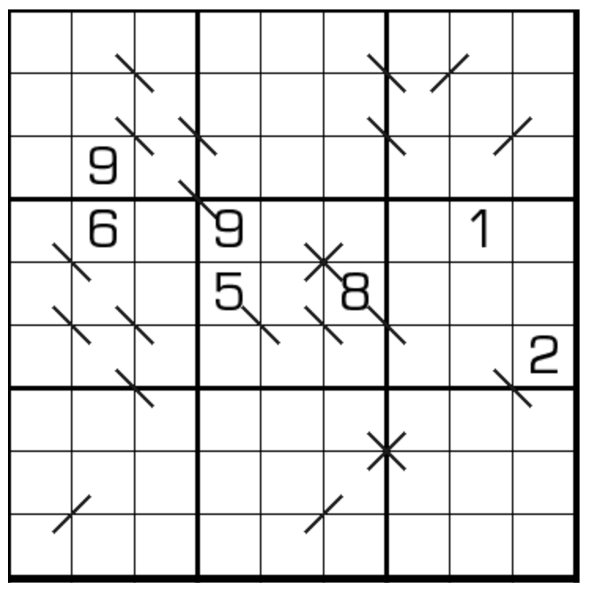

# 规则
| 序号  | 限制区域 | 限制规则                             | 备注  |
|:---:|:----:|:---------------------------------|:---:|
|  1  |  行   | [1~9填充]                         |     |
|  2  |  列   | [1~9填充]                         |     |
|  3  |  宫   | [1~9填充]                         |     |
|  4  | 标记顶点 | `／`：标记顶点的左下格与右上格差为 1（即满足[斜连续]约束） | 全标  |
|  5  | 标记顶点 | `＼`：标记顶点的左上格和右下格差为 1（即满足[斜连续]约束） | 全标  |

# 题库

## 在线题库
- [独·数之道](http://www.sudokufans.org.cn/lx/game.index.php?type=lxx) 【需要登录】

[1~9填充]: ../../../../../../rules.md#1to9填充
[斜连续]: ../../../../../../rules.md#斜连续