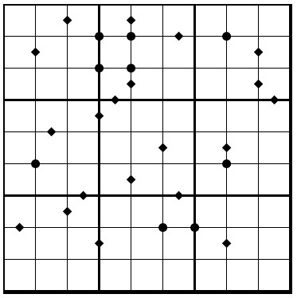

## 规则
| 序号 | 限制区域 | 限制规则 | 备注 |
| :---: | :---: | :--- | :---: |
| 1 | 行 | [1~9填充] | |
| 2 | 列 | [1~9填充] | |
| 3 | 宫 | [1~9填充] | |
| 4 | 标记边 | 标记边两侧的[共边邻格]的和或积 = 15 | 半标 |
| 5 | 标记点 | 标记点周围 4 格的和 = 20 | 半标 |

## 题库
- [独·数之道](http://www.sudokufans.org.cn/lx/game.index.php?type=ts4) 【需要登录】

[1~9填充]: ../../../../../rules.md#1~9填充
[共边邻格]: ../../../../../rules.md#共边邻格