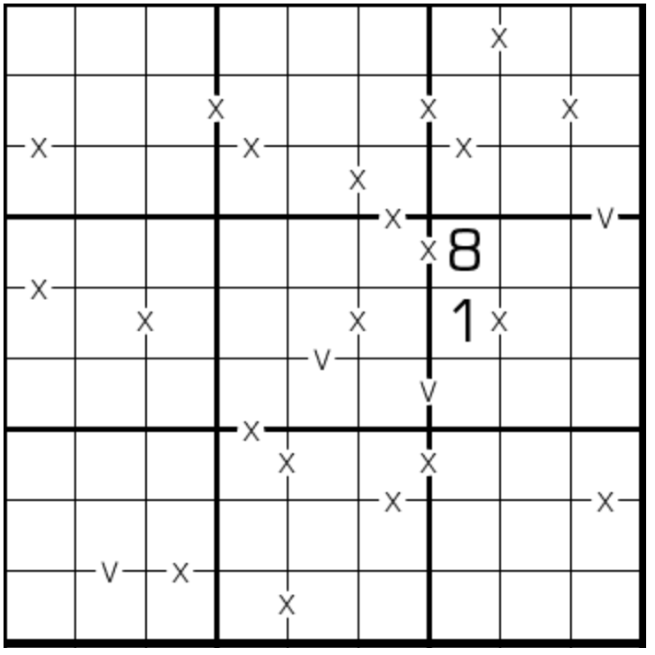

# 规则

| 序号  | 限制区域 | 限制规则                 | 备注  |
|:---:|:----:|:---------------------|:---:|
|  1  |  行   | [1~9填充]              |     |
|  2  |  列   | [1~9填充]              |     |
|  3  |  宫   | [1~9填充]              |     |
|  4  | 标记边  | 标记边`V`两侧的[共边邻格]和为 5  | 全标  |
|  5  | 标记边  | 标记边`X`两侧的[共边邻格]和为 10 | 全标  |

# 别名

- VX数独
- 全标VX数独
- XV Sudoku

# 题库

## 在线题库

- [独·数之道](http://www.sudokufans.org.cn/lx/game.index.php?type=vxa) 【需要登录】
- [今日数独]【选题不便】

[1~9填充]: ../../../../../../rules.md#1~9填充

[共边邻格]: ../../../../../../rules.md#共边邻格

[今日数独]: https://cn.sudoku.today/g-xv-sudoku-2/
