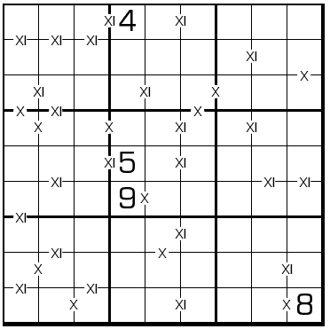

# XI数独

## 规则

| 序号  | 限制区域 | 限制规则                  |        备注        |
|:---:|:----:|:----------------------|:----------------:|
|  1  |  行   | [1~9填充]               |                  |
|  2  |  列   | [1~9填充]               |                  |
|  3  |  宫   | [1~9填充]               |                  |
|  4  | 标记边  | 标记边`X`两侧的[共边邻格]和为 10  | 全标, 'X'是罗马数字 10  |
|  5  | 标记边  | 标记边`XI`两侧的[共边邻格]和为 11 | 全标, 'XI'是罗马数字 11 |

## 题库

### 在线题库

- [独·数之道](http://www.sudokufans.org.cn/lx/game.index.php?type=vx2) 【需要登录】

[1~9填充]: ../../../../../rules.md#1to9填充
[共边邻格]: ../../../../../rules.md#共边邻格
