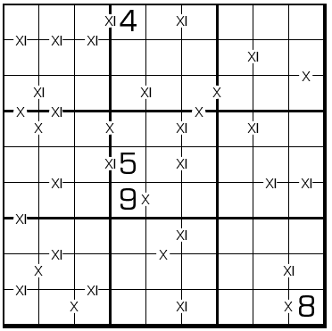

# 三八数独
<!-- START doctoc generated TOC please keep comment here to allow auto update -->
<!-- DON'T EDIT THIS SECTION, INSTEAD RE-RUN doctoc TO UPDATE -->
## 目录

- [规则](#%E8%A7%84%E5%88%99)
- [题库](#%E9%A2%98%E5%BA%93)
  - [在线题库](#%E5%9C%A8%E7%BA%BF%E9%A2%98%E5%BA%93)

<!-- END doctoc generated TOC please keep comment here to allow auto update -->

## 规则

| 序号  |  限制区域  | 限制规则                     |        备注        |
|:---:|:------:|:-------------------------|:----------------:|
|  1  |   行    | [1~9填充]                  |                  |
|  2  |   列    | [1~9填充]                  |                  |
|  3  |   宫    | [1~9填充]                  |                  |
|  4  | 提示数（边） | 提示数`8`两侧的[共边邻格]的积的个位数为 8 | 全标，即A * B = `*8` |
|  5  | 提示数（边） | 标记边`3`两侧的[共边邻格]的积的十位数为 3 | 全标，即A * B = `3*` |

## 题库

### 在线题库

- [独·数之道](http://www.sudokufans.org.cn/lx/game.index.php?type=38) 【需要登录】

[1~9填充]: ../../../../../rules.md#1to9填充
[共边邻格]: ../../../../../rules.md#共边邻格
