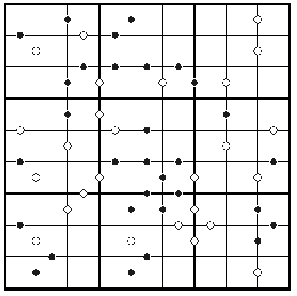

# 十一数独

## 规则

| 序号  | 限制区域 | 限制规则                            | 备注  |
|:---:|:----:|:--------------------------------|:---:|
|  1  |  行   | [1~9填充]                         |     |
|  2  |  列   | [1~9填充]                         |     |
|  3  |  宫   | [1~9填充]                         |     |
|  4  | 标记边  | 标记边黑点两侧的[共边邻格]的和或积 = 10         | 全标  |
|  5  | 标记边  | 标记边白点两侧的[共边邻格]的差 = 1（即满足[连续]约束） | 全标  |

## 题库

### 在线题库

- [独·数之道](http://www.sudokufans.org.cn/lx/game.index.php?type=hbc) 【需要登录】

[1~9填充]: ../../../../../rules.md#1to9填充
[共边邻格]: ../../../../../rules.md#共边邻格
