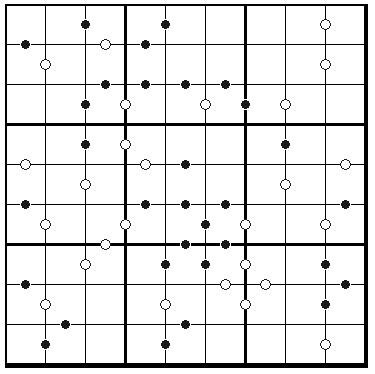

# 十一数独
<!-- START doctoc generated TOC please keep comment here to allow auto update -->
<!-- DON'T EDIT THIS SECTION, INSTEAD RE-RUN doctoc TO UPDATE -->

<!-- END doctoc generated TOC please keep comment here to allow auto update -->

## 规则

| 序号  | 限制区域 | 限制规则                                                       |        备注         |
| :-: | :--: | :--------------------------------------------------------- | :---------------: |
|  1  |  行   | [1~9填充]                                                    |                   |
|  2  |  列   | [1~9填充]                                                    |                   |
|  3  |  宫   | [1~9填充]                                                    |                   |
|  4  | 标记边  | 标记边黑白点两侧的[共边邻格]的   - 和或积 = 10   - 差 = 1（即满足[连续]约束） | 全标  对应关系需自行判断 |

## 题库

### 在线题库

- [独·数之道](http://www.sudokufans.org.cn/lx/game.index.php?type=hbc) 【需要登录】

[1~9填充]: ../../../../../rules/rules.md#1to9填充
[共边邻格]: ../../../../../rules/rules.md#共边邻格
