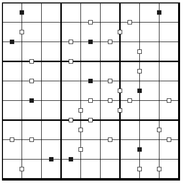

## 规则
| 序号 | 限制区域 | 限制规则 | 备注 |
| :---: | :---: | :--- | :---: |
| 1 | 行 | [1~9填充] | |
| 2 | 列 | [1~9填充] | |
| 3 | 宫 | [1~9填充] | |
| 4 | 标记边 | 标记边黑块两侧的[共边邻格]满足 3 倍关系 | 全标 |
| 5 | 标记边 | 标记边白块两侧的[共边邻格]的差 = 2 | 全标 |
> `1`和`3`之间可能标记黑点，也可能标记白点

## 题库
- [独·数之道](http://www.sudokufans.org.cn/lx/game.index.php?type=hbk) 【需要登录】

[1~9填充]: ../../../../../rules.md#1~9填充
[共边邻格]: ../../../../../rules.md#共边邻格