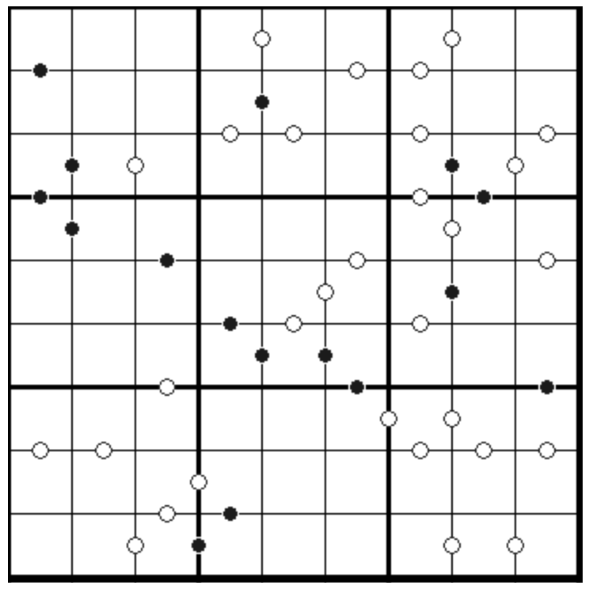

# 规则

| 序号  | 限制区域 | 限制规则                            | 备注  |
|:---:|:----:|:--------------------------------|:---:|
|  1  |  行   | [1~9填充]                         |     |
|  2  |  列   | [1~9填充]                         |     |
|  3  |  宫   | [1~9填充]                         |     |
|  4  | 标记边  | 标记边黑点两侧的[共边邻格]满足 2 倍关系          | 全标  |
|  5  | 标记边  | 标记边白点两侧的[共边邻格]的差 = 1（即满足[连续]约束） | 全标  |

> `1`和`2`之间可能标记黑点，也可能标记白点

# 别名

- 黑白点数独
- 围棋点数独
- Kropki Sudoku
- Kropki Pair Sudoku

# 题库

## 在线题库

- [独·数之道](http://www.sudokufans.org.cn/lx/game.index.php?type=hb) 【需要登录】
- [今日数独]【选题不便】

# 技巧

- 三连黑
- 二连黑

# 扩展题型

- [0-9 黑白点](../../../../混合类/0-9黑白点.md)
- [黑白点+数比数独](../../../../混合类/黑白点+数比数独.md) 【需要登录】

[1~9填充]: ../../../../../../rules.md#1to9填充

[共边邻格]: ../../../../../../rules.md#共边邻格

[连续]: ../../../../../../rules.md#连续

[今日数独]: https://cn.sudoku.today/g-kropki-sudoku/
