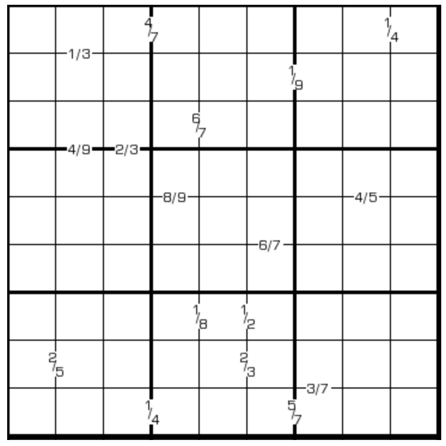

# 规则

| 序号  |  限制区域   | 限制规则                  |
|:---:|:-------:|:----------------------|
|  1  |    行    | [1~9填充]               |
|  2  |    列    | [1~9填充]               |
|  3  |    宫    | [1~9填充]               |
|  4  | 提示数（边）  | 提示数`Q`：两侧[共边邻格]的商为 Q  |
|  5  | 提示数（顶点） | 提示数 `/Q`：左下格与右上格的商为 Q |
|  6  | 提示数（顶点） | 提示数 `\Q`：左上格和右下格的商为 S |

# 题型名

- 商数独

# 题库

## 在线题库

- [独·数之道](http://www.sudokufans.org.cn/lx/game.index.php?type=98) 【需要登录】
- [今日数独]【选题不便】

[1~9填充]: ../../../../rules.md#1~9填充

[共边邻格]: ../../../../rules.md#共边邻格

[今日数独]: https://cn.sudoku.today/g-quotients-sudoku/
