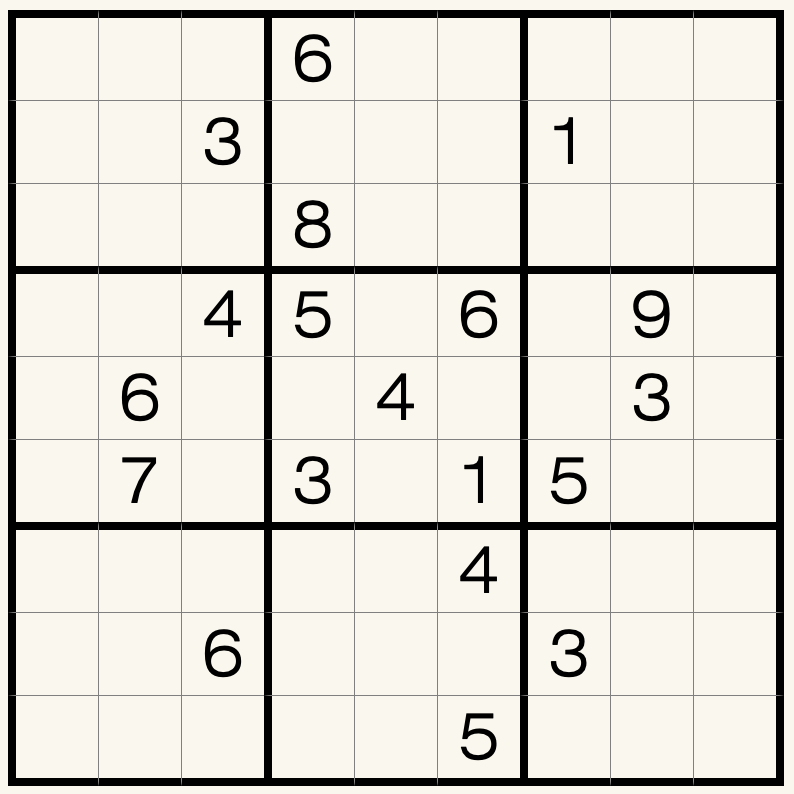

# 小满数独
<!-- START doctoc generated TOC please keep comment here to allow auto update -->
<!-- DON'T EDIT THIS SECTION, INSTEAD RE-RUN doctoc TO UPDATE -->

<!-- END doctoc generated TOC please keep comment here to allow auto update -->

## 规则

| 序号 | 限制区域 | 限制规则 | 备注 |
| :---: | :---: | :--- | :---: |
| 1 | 行 | [1~9填充] | |
| 2 | 列 | [1~9填充] | |
| 3 | 宫 | [1~9填充] | |
| 4 | 全盘 | 存在 1 个小满数 S，使得每个`5`都满足：其[共边邻格]的和 = S | 小满数包括`21` `22` `23` |

## 题型名

- 小满数独

### 微信小程序

- ~~变形数独~~

[1~9填充]: ../../../../rules/rules.md#1to9填充
[共边邻格]: ../../../../rules/rules.md#共边邻格
