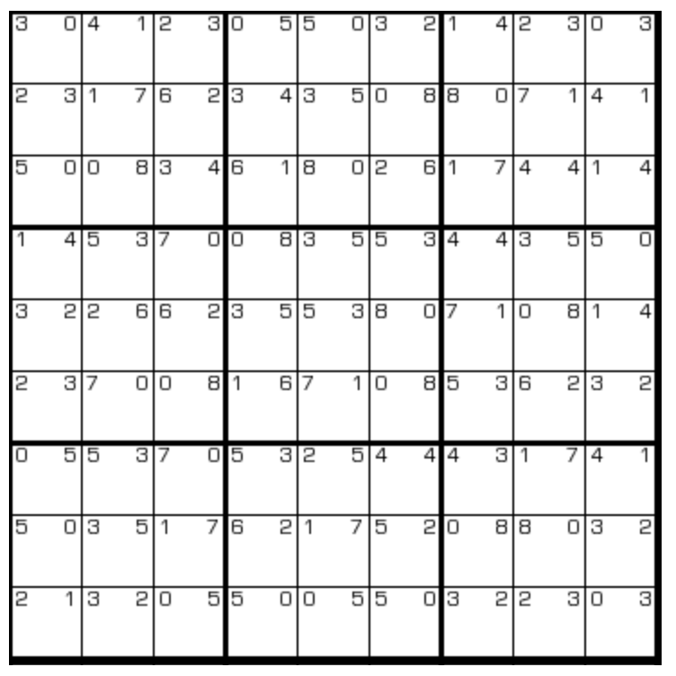

# 排队数独

## 规则

| 序号 | 限制区域 | 限制规则 |
| :---: | :---: | :--- |
| 1 | 行 | [1~9填充] |
| 2 | 列 | [1~9填充] |
| 3 | 宫 | [1~9填充] |
| 4 | 提示数（格） | 提示数`L G`：当前格的[邻格]中，有 L 个数比当前格小，有 G 个数比当前格大 |

## 题型名

- 排队数独

## 题库

### 在线题库

- [独·数之道](http://www.sudokufans.org.cn/lx/game.index.php?type=pd) 【需要登录】

[1~9填充]: ../../../../rules.md#1to9填充
[邻格]: ../../../../rules.md#邻格
