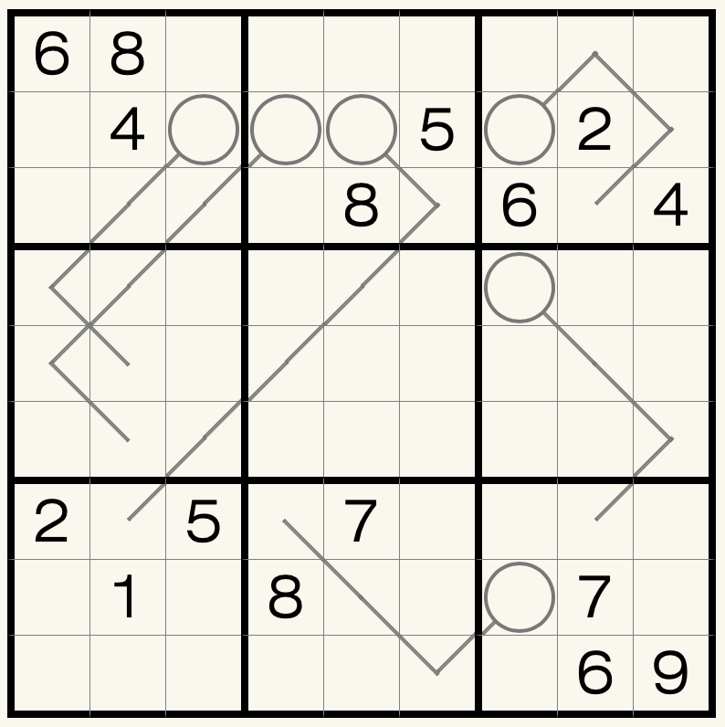

# 爆头箭数独
<!-- START doctoc generated TOC please keep comment here to allow auto update -->
<!-- DON'T EDIT THIS SECTION, INSTEAD RE-RUN doctoc TO UPDATE -->
## 目录

- [规则](#%E8%A7%84%E5%88%99)
- [题型名](#%E9%A2%98%E5%9E%8B%E5%90%8D)
  - [微信小程序](#%E5%BE%AE%E4%BF%A1%E5%B0%8F%E7%A8%8B%E5%BA%8F)

<!-- END doctoc generated TOC please keep comment here to allow auto update -->

## 规则

| 序号 | 限制区域 | 限制规则 |
| :---: | :---: | :--- |
| 1 | 行 | [1~9填充] |
| 2 | 列 | [1~9填充] |
| 3 | 宫 | [1~9填充] |
| 4 | 标记区域 | 圆圈表示箭尾，线的最远端表示箭头  标记区域同时满足：  - 线上数字的和 > 箭尾 - 线上数字的和 - 箭头 < 箭尾 |

## 题型名

- 爆头箭数独

### 微信小程序

- ~~变形数独~~

[1~9填充]: ../../../../rules/rules.md#1to9填充
