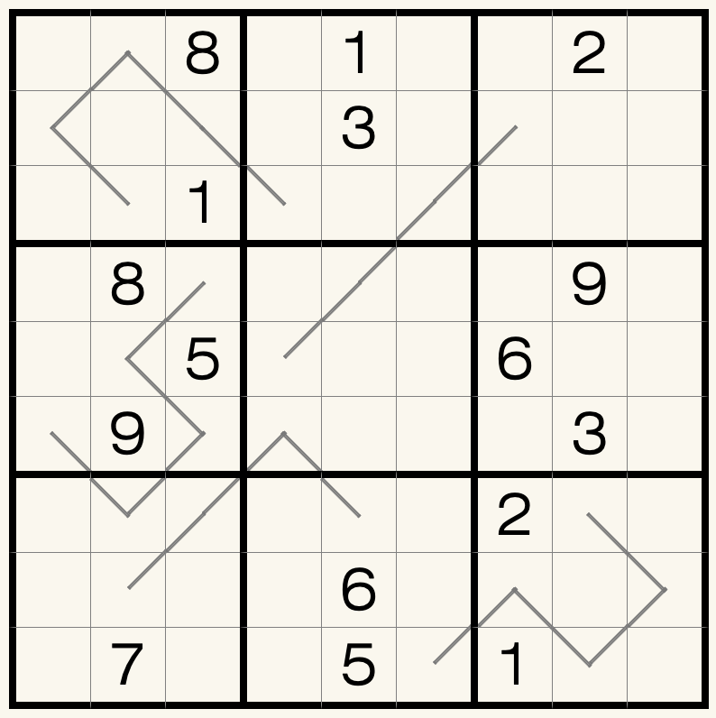

# 等差数独
<!-- START doctoc generated TOC please keep comment here to allow auto update -->
<!-- DON'T EDIT THIS SECTION, INSTEAD RE-RUN doctoc TO UPDATE -->

<!-- END doctoc generated TOC please keep comment here to allow auto update -->

## 规则

| 序号 | 限制区域 | 限制规则 |
| :---: | :---: | :--- |
| 1 | 行 | [1~9填充] |
| 2 | 列 | [1~9填充] |
| 3 | 宫 | [1~9填充] |
| 4 | 标记区域 | 沿标记线，数字呈等差数列 |

## 题型名

- 等差数独

## 题库

### 微信小程序

- ~~变形数独~~

## 扩展题型

- [递增数独](../../比大小类/递增数独.md)

[1~9填充]: ../../../../rules/rules.md#1to9填充
