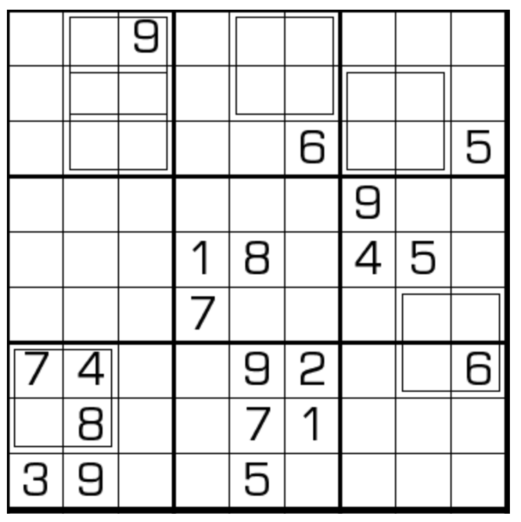

# 规则
| 序号 | 限制区域 | 限制规则 | 备注 |
| :---: | :---: | :--- | :---: |
| 1 | 行 | [1~9填充] | |
| 2 | 列 | [1~9填充] | |
| 3 | 宫 | [1~9填充] | |
| 4 | 标记区域 | 2*2 区域内，上方两格之积 = 下方的两位数 | 即 `左上` * `右上` = `左下` * 10 + `右下` |

# 题型名
- 算式数独

# 题库

## 在线题库
- [独·数之道](http://www.sudokufans.org.cn/lx/game.index.php?type=cs) 【需要登录】

# 扩展题型
- [倒算式数独](倒算式数独.md)

[1~9填充]: ../../../../rules.md#1to9填充